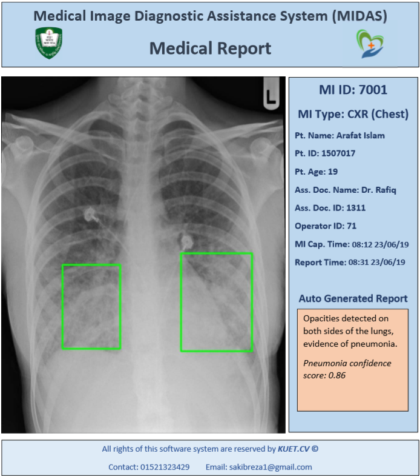

# Medical Image Diagnosis Assistant System

## Python Package Dependencies
1. Django
2. opencv-python
3. django-crispy-forms
4. scikit-learn
5. scikit-image
6. tensorflow

## Quick start running the project
 1. clone repo `https://github.com/asif001/midas_final.git`
 2. Install required python dependencies into your python virtual environment (see runtime.txt) - `pip install -r requirements.txt`.
 5. create superuser following https://docs.djangoproject.com/en/1.8/intro/tutorial02/
 6. Go to address http://127.0.0.1:8000/admin and add doctor, patient and assistant login details
 7. migrate database using `python manage.py makemigrations` and `python manage.py migrate`
 8. After successful migration execute `python manage.py runserver`
 9. Go to address http://127.0.0.1:8000/home
10. enjoy

## Introduction
In this project an web application has been implemented to detect diseases and monitor them using different image processing tools.
An automated prescription ystem also implemented using keras Deep Learning library. Disease detection accuracy average 95% on Breast Cancer, Musculoskeletal Disorder and Pneumonia.

## Motivation
The project is made for the international competition IEEE YESS12: Maker Fair 2019

## Report

## Features
* Works as an assistant of doctor
* Powered by Machine learning and Deep Learning
* Detect diseases and report to the doctor
* Automated system to prescribe
* Image processing tools to inspect disease images better

## Contributing
The main reason to publish something open source, is that anyone can just jump in and start contributing to my project.
So If you'd like to contribute, please fork the repository and use a feature branch. Pull requests are warmly welcome.

## Author
Asifur Rahman
asifurarahman@gmail.com
Student at Department of Computer Science and Engineering
Khulna University of Engineering & Technology, Khulna
Bangladesh
